# Project 5

With this project we are working on keypoint detection using neural networks. Neural networks are important because they can approximate arbitrary and complex functions really well. By utilizing convolutional layers, our network will generalize fairly well.

**Part 1: Nose Detection**

Here are some images printed from the dataset with noses marked. These are the inputs to the network.

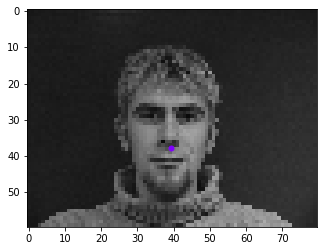

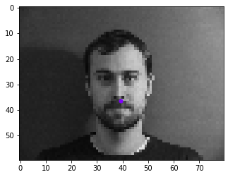

Here is the model architecture. It is 2 convolutional layers followed by 3 linear layers. I couldnt do too many conv layers here since the input size is fairly small. I also tried a second version of this network where I added in another conv layer and took away one linear layer. I used an Adam optimizer with learning rate .001

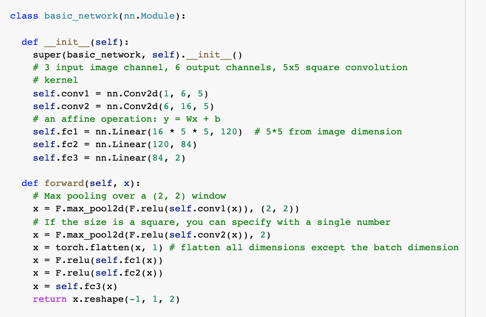

Here is one training from the 3 conv layer network. It seems to train really fast, which is fine, since test losses also decrease and could be worse.

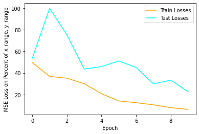

Here are some results from this network.

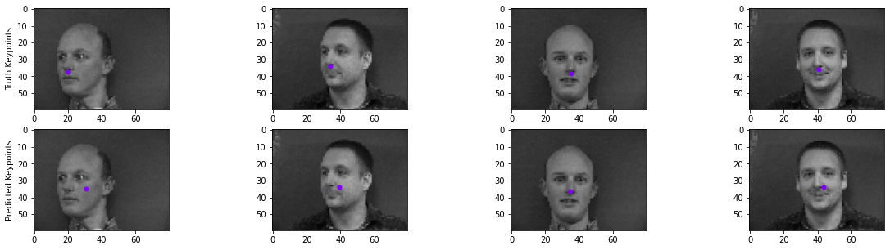

You can see that it does fine for when the faces are turned straight forward, but fails in 2 cases where identical faces are turned to the side. This is because we don't do any kind of global pooling at the end of the convolution layers, allowing the network to put a prior on the middle of the image since features in the middle of the output volume from the convolution layers correspond to where the noses were. In general, it is clear that the network is putting a prior on the middle of the image and biasing towards the middle of faces, regardless of which direction they are turned.

I tried messing with some hyperparameters below.

L1 loss:

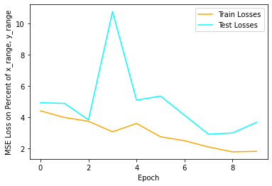
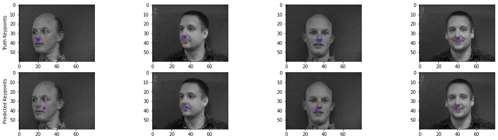

20 Epochs, 10x smaller learning rate (.0001):

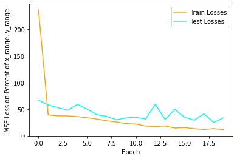
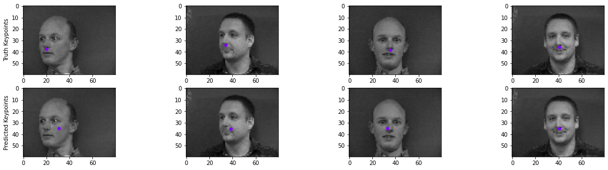

Neither of these seemed to have an effect, the dataset is just too small and it is too easy to put a prior on the middle of the image, allowing the network to hedge its bets.

**Part 2: Full Facial Keypoints Detection**

Here, we will beef up our network and try and detect all the keypoints, not just the nose.

Here is an image from the dataloader. We have data augmentations applied for color jitter, rotations, homographies, etc. I found a cool library called Albumentations which removes most of the annoying work of updating the keypoints after these image transformations. We're not going to consider image flips as a transformation since in part 3 we won't need this transformation.

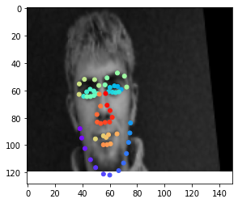
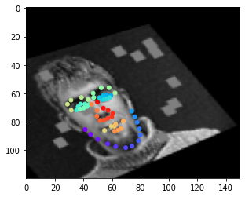

You can see that there is a rotation, and a possibly one of the homography transformation, yet the keypoints are all still aligned. One of the issues you may be able to spot is that sometimes the keypoints leak over the edge of the image. Unfortunately, there isn't much we can do about that if we want all these crazy image permutations, it just means we can't do a sigmoid on our network outputs which could have been nicely put into a 0-1 range to represent the low and high sides of the image (0, 1). That being said, we do ok without that extra possible functionality.

Here is our network architecture.

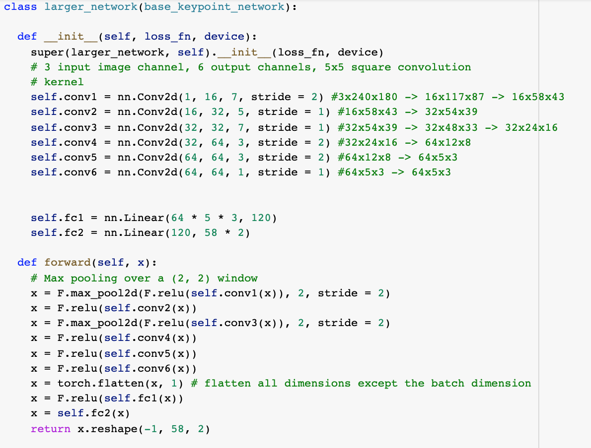

We have 6 conv layers, with pooling layers of stride 2 after the first and third layers. This was arbitrary, I just wanted to have some pooling layers near the start of the network. I choose 1 and 3 because I wanted to pool the immediate features that are basic like edges and stuff. I also added a stride of 2 on the first conv layer to add to this effect. I wanted to give the network a layer to compute more complex local features in the second layer before pooling or striding again, which I do on the third layers. I use convolutions of size 7 at first just to make sure I can pick up larger features if needed, then 5 while computing more complex features, and then 7 again to cover a larger area again before we start getting real deep. Later on in the network, I needed to add a stride 2 again just to reduce volume as the number of channels went up quickly from 1 to 16 to 32 to 64. I also have 2 linear layers at the end. Relu activations everywhere.

I used a MSE loss, where keypoints are in the range from -.5 to .5 (0 being in the middle of the image) for both width and height. I scaled the prediction / truth values by 100 at the end just to make sure that the loss values are on the scale of unit magnitude. The learning rate was .001 on an Adam optimizer. Batch size was 8. Since our augmentations allow us to get more milage out of our images, I manually set my dataset size to 1024, where the images are cycled with new augmentations each time. I trained for 20 epochs. Here is the training log. You can see that image augmentations provide strong regularization as our test loss is almost always lower than the training loss... which is good since our test set is easier without augmentations applied.

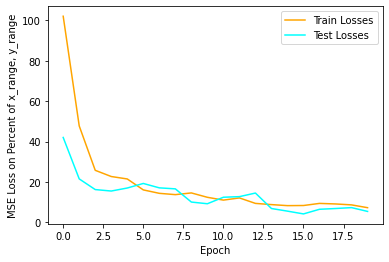

Here are some outputs. All the outputs that I looked at were pretty good, but there seems to be this persistent issue with eyes suddenly jerking upwards.

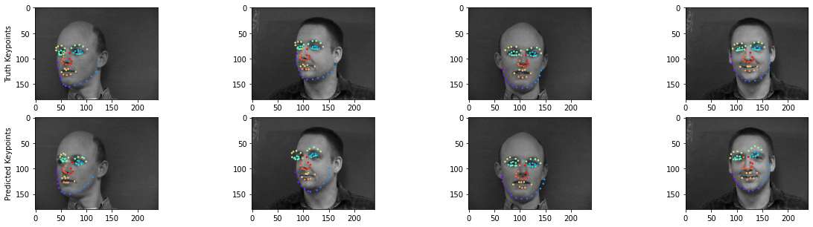

You can see that the network does pretty well on the middle two images, but on the outer images, there is one eye that jerks up. It seems to be somewhat random, I can't figure why it would occur. I thought that it was a factor of the head tilt at first, but the second image doesn't seem to have as much tilt as the last image, and in the second image, the head tilt is much greater. My only guess is that the network is trying to hedge its bets for the occasional random rotation augmentation. Other than that, the keypoint detection seems to be pretty spot on.

Here are some of the learned filters at the first layer. Some are good and some are garbage.

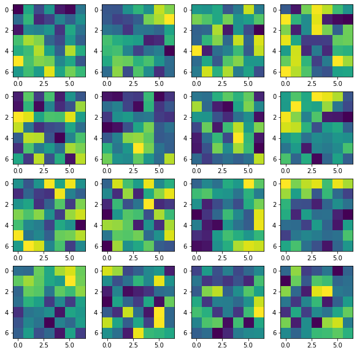

In filters (starting from 1 going from left to right, then top to bottom) 1, 11, 12, 13 we can see something of an edge detector, with high value weights tending to be on one side of the filter, and lower weights along the other. We can somewhat see this for a line going through the middle of the filter in filter 2. The rest of the filters I don't know what to make of, the best I can say for some like filters 4,6,7 is that they are either bright or dim in the middle, indicating some sort of dot detector. I will admit that I should have probably gone for a smaller filter at this stage. I think the larger filter size is messing things up, allowing the network to learn more nonsense when it should be doing things like edge detectors.

**Part 3: Train With Larger Dataset**

Here are some datapoints from our larger dataset. The same wild augmentations are being applied, only this time we also have color since I went with an out of the box pretrained resnet18, retraining some of the last layers.

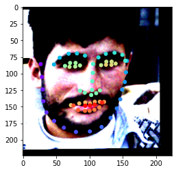
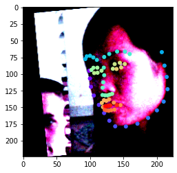
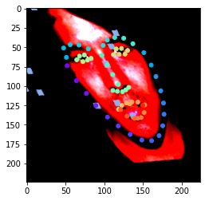

For the network architecture specifically, I just took the pretrained resnet18, retrained the conv4 block and the last fc layers, changing the output to be of shape 68 * 2 for the xy coordinates of our 68 keypoints. I used a learning rate of .001, training for 20 epochs, a batchsize of 32, and all the data augmentations above, throwing the book at it.

I'll be honest, this training was somewhat pitiful.

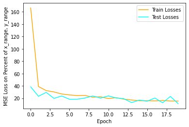

The lowest validation losses were 19... this could be better. If we look at the outputs on validation data, we may see why.

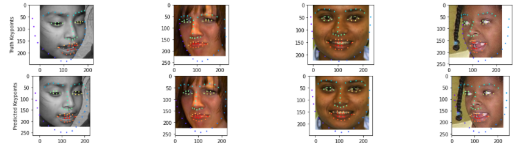

You can see that the eyes, noses, mouths, all look pretty good, but the sides of the face are not good. I suspect that this is an issue for a number of reasons. I think that the main reason is that this is a pretrained model for image classification (imagenet). The later layers are computing really high level features corresponding to different objects, yet we need to propagate low level features corresponding to the sides of the face in order to get those keypoints on the side of the face. I think that this is the main reason for the failure that we see when it comes to the sides of the face not having the right keypoints, while features like eyes having the right keypoints.

Here are some faces that were predicted from my own personal curated collection. Just kidding I just love pictures of this one dude. And I also did a picture of myself just for fun. This is a difficult image to do since his hair makes his head look not like other heads. You can see that in how the eyes are usually generally in the right space (except for when he has glasses and is looking up... making his face shorter from our perspective which make things more difficult... tho you can see that EITHER his eyes or mouth will be in the right place), but the keypoints for the side of the face are messed up. Enjoy.

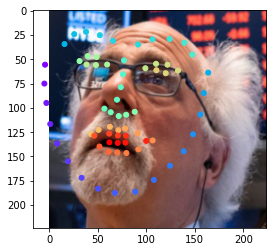

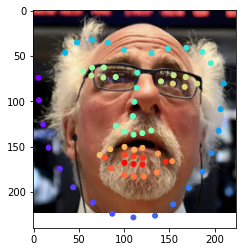

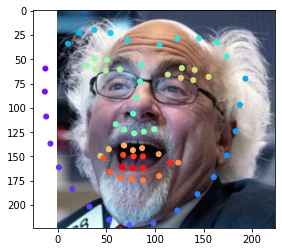
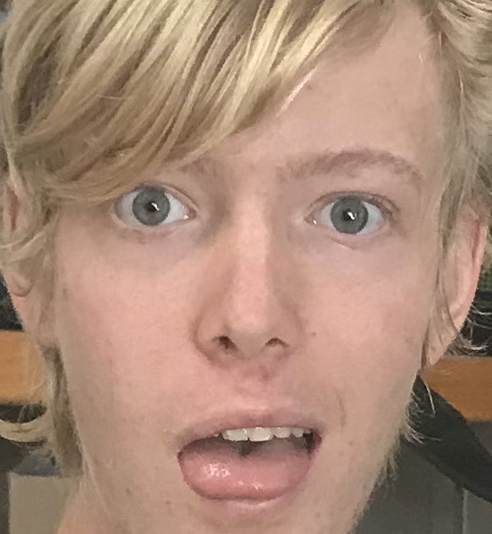
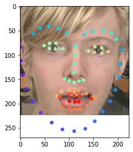

**Bells and Whistles**

PCA Approach:
For a bells and whistles, instead of making keypoint detection a classification task, which sounded like over-engineering a problem that shouldn't be that hard, I instead wanted to take a simpler approach. This task to me feels like something that we're asking the network to do too much for. All keypoint annotated faces sort of look pretty similar. Not to mention how hard it is for the network to annotate the sides of the face, where the local features around the keypoint all look the same for every keypoint on the side of the face. It really feels like every face is the same, with some minor variations, and to capture that, I wanted to run PCA on the keypoints. I found out that just 12 keypoint faces can capture 99% of the variance in the data, and wanted to try and see if I could get the network to predict these reduced dimension representations instead. The resuts were mixed. Empirically, they do worse, but if you look at the actual predictions themselves, they look pretty good. They tend to undershoot the actual keypoint by a pretty good margin, but I suspect I know why, and the predicted points look like an actual face... super smooth keypoint predictions compared to the regular network.

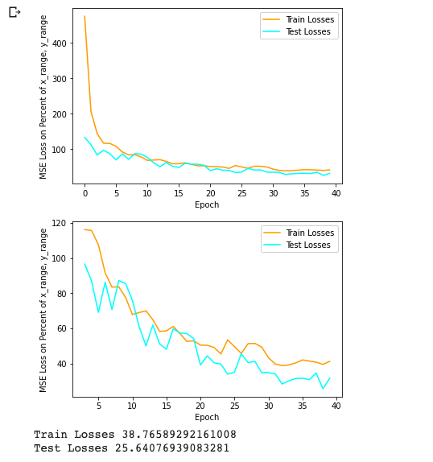
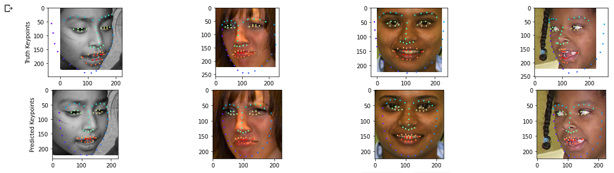

This does worse than my regular network, however the smoothness of keypoint predictions makes this an admirable attempt. I think the issue is the network itself. The issue is similar to the issue I pointed out in using a pretrained resnet18 on imagenet, the later features being fed to the weights and biases in the network that are being modified by our optimizer correspond to high level object features like whether there are eyes, or legs, etc. The features computed by a resnet trained on imagenet don't lend themselves to the task of predicting the really high dimensional features computed by PCA. Remember, in this case our objective is to try and see which KIND of keypoint set/face this image is, so we can spit out the weights in a linear combination of keypoint sets. Computing those weights requires more textural information later in the network to see exactly what kind of shape the nose is, what kind of shape the face is... things that aren't being computed by this pretrained resnet. As such, the network has difficulty in making predictions. And since this is a regression task and the weights for our linear combination tend to be centered around zero, we see that the predicted faces are a little smaller since to hedge its bets, the network is predicting small weights for our PCA basis.

I think if I was to do this experiment again, I would create a network with super dense convolutions at the start (low stride and no pooling since we want a smaller aperture and full resolution on each weight so to speak as we want textural information like what shape the nose is) and then do lots of large convolutions with high stride and pooling to quickly reduce the size of the feature volume and prevent it from trying too many super high level features (since again what our network is doing is computing which KIND of shape of face this is)
